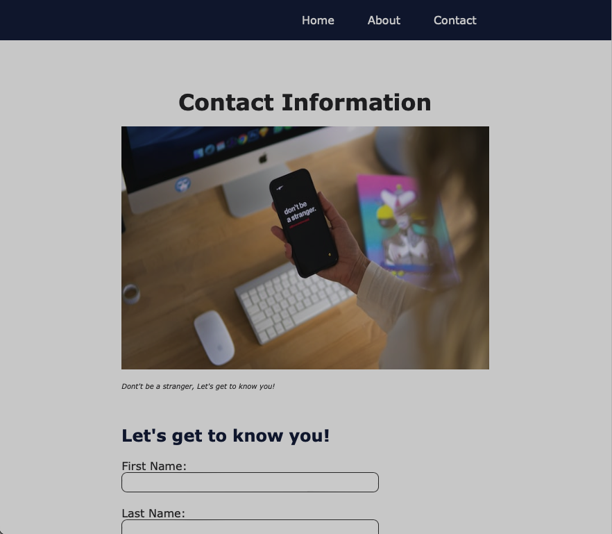

# Mini-Project: Landing Page

## Description
In this mini-project, I built a landing page using HTML and CSS. This landing page collects a visitor's contact information

## Usage

Please click on the text fields to enter your details, then cliick the send butoon to submit the form

## Screenshot

## Link

## Credits
* Photo by <a href="https://unsplash.com/@chenhanozel?utm_source=unsplash&utm_medium=referral&utm_content=creditCopyText">Chen Mizrach</a> on <a href="https://unsplash.com/?utm_source=unsplash&utm_medium=referral&utm_content=creditCopyText">Unsplash</a>

* <a href="https://www.flaticon.com/free-icons/twitter" title="twitter icons">Twitter icons created by Stockio - Flaticon</a>

* <a href="https://www.flaticon.com/free-icons/facebook" title="facebook icons">Twitter icons created by Stockio - Flaticon</a>

* <a href="https://www.flaticon.com/free-icons/linkedin" title="linkedin icons">Linkedin icons created by Stockio - Flaticon</a>

  
## Licence
Please refer to the LICENCE in the repo
